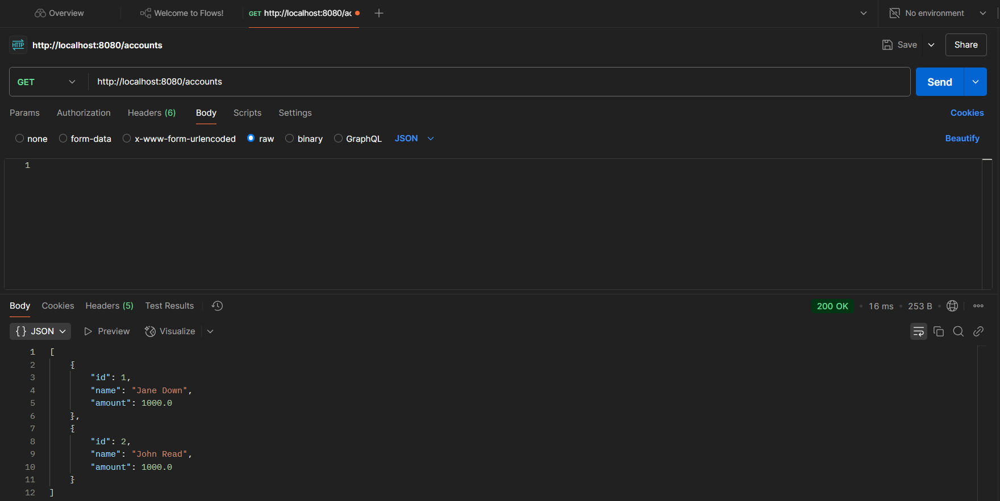
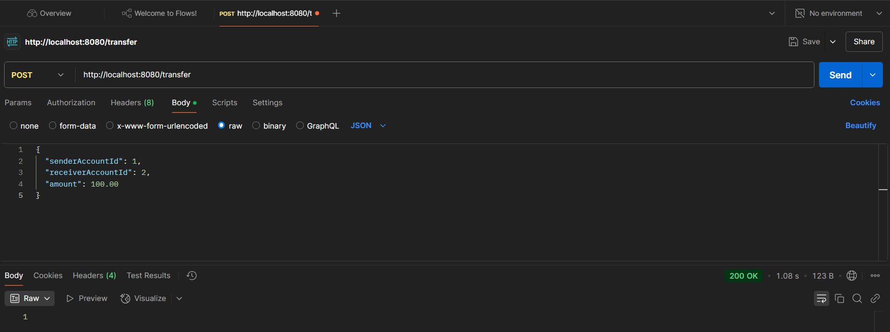
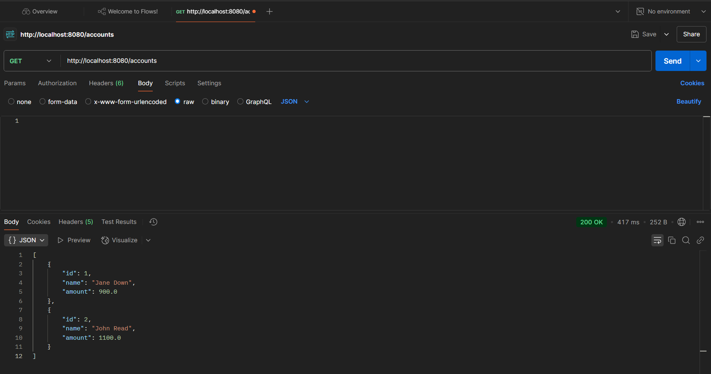
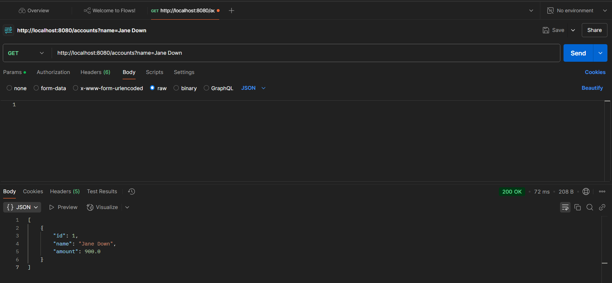

# Transfer-Money-App 🚀
El programa es una aplicación simple de transferencia de dinero entre cuentas bancarias.

---

## 🛠️ Tecnologías utilizadas

- **Spring Boot**: Framework para construir aplicaciones Java.
- **H2 Database**: Base de datos en memoria para pruebas y desarrollo.
- **Spring Data JDBC**: Para la gestión de operaciones de base de datos.
- **JUnit y Mockito**: Para pruebas unitarias y de integración.
- **Postman**: Como cliente para enviar solicitudes GET y POST

---

## 🚀 ¿Qué hace esta aplicación?

El **Transfer-Money-App** permite transferir dinero entre cuentas bancarias. Proporciona endpoints para:
- Transferir dinero entre dos cuentas.
- Obtener todas las cuentas o filtrarlas por nombre.
- Gestionar cuentas (crear, actualizar, eliminar).

---

## 🛠️ Requisitos previos

Antes de ejecutar la aplicación, asegúrate de tener instalado:
- **Java 17 o superior**: [Descargar Java](https://www.oracle.com/java/technologies/javase-downloads.html)
- **Maven o Gradle**: [Descargar Maven](https://maven.apache.org/download.cgi) | [Descargar Gradle](https://gradle.org/install/)
- **Un IDE** (opcional pero recomendado): IntelliJ IDEA, Eclipse o VS Code.

---

## 🧩 Estructura del proyecto
```plaintext
src/
├── main/
│ ├── java/
│ │ ├── com.example/
│ │ │ ├── controllers/ # Controladores REST
│ │ │ ├── dto/ # Objetos de transferencia de datos (DTOs)
│ │ │ ├── exceptions/ # Excepciones personalizadas
│ │ │ ├── model/ # Entidades del dominio
│ │ │ ├── repositories/ # Repositorios para acceder a la base de datos
│ │ │ ├── services/ # Lógica de negocio
│ │ │ └── Main.java # Punto de entrada de la aplicación
│ └── resources/
│ └── application.properties # Configuración de la aplicación
└── test/
└── java/
└── com.example/
└── services/ # Pruebas unitarias y de integración
```
---

## 🖼️ Capturas de pantalla

### Saldos al inicio


### Probar el Endpoint POST /transfer


### Probar el Endpoint GET /accounts


### Filtrar cuentas por nombre



